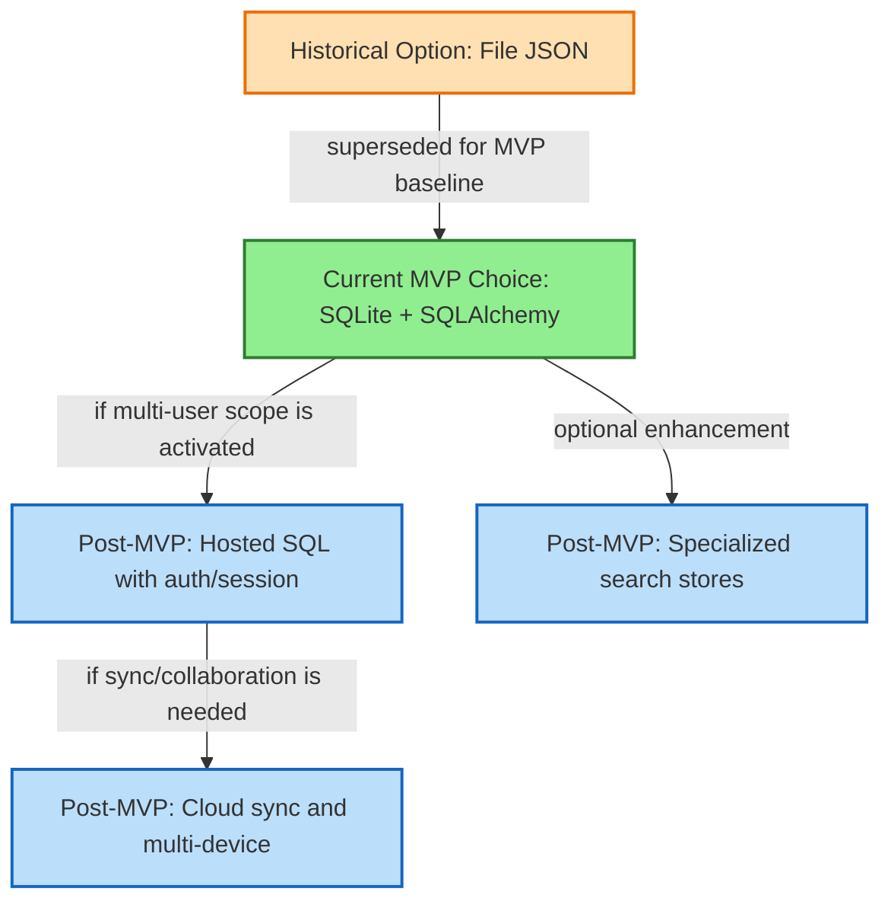

# AstraNote Storage Decision Map

This document captures why AstraNote selected its current MVP storage implementation and what options remain for Post-MVP evolution.

## Current Decision Snapshot

- Current MVP choice: SQLite via `SqlNoteRepository`.
- Runtime shape: single-user local web app on localhost.
- Security requirement: encrypted note title/body at rest with private-note PIN flows.
- Supporting artifacts: `astranote.db`, `audit-log.jsonl`, `astranote.log`, and `config.json` in the runtime data directory.

## Option Landscape and Evolution Path

## Decision Criteria Summary

| Option | Status | Strengths | Risks / Limits |
|---|---|---|---|
| File JSON | Historical (not active MVP backend) | very simple local bootstrap | weak query/concurrency ergonomics, harder long-term evolution |
| SQLite + SQLAlchemy | Selected for MVP | ACID persistence, straightforward local operations, testable repository boundary | single-node/local assumptions, migration governance still lightweight in MVP |
| Hosted SQL (Post-MVP) | Deferred | stronger multi-user readiness and deployment flexibility | requires auth/session hardening and deployment/security work |
| Cloud sync layers (Post-MVP) | Deferred | enables multi-device experience | higher complexity in conflict resolution and operational cost |
| Specialized search stores (Post-MVP) | Deferred | richer search capabilities | additional infra and data consistency concerns |

## Why SQLite Was Chosen for MVP

1. Aligns with local localhost delivery and single-user scope.
2. Supports current encryption-at-rest model without introducing remote dependency complexity.
3. Works cleanly with service/repository boundaries already implemented.
4. Keeps startup, test, and grading workflows reliable for course delivery.

## Reader Guidance

- Read `storage_design.md` for implementation truth (what exists now).
- Read this decision map for tradeoffs, rationale, and future direction.
